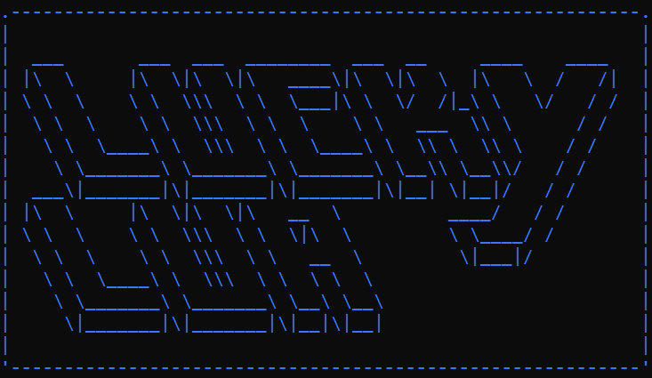

<div align="center">


------

Lucky Lua is a CLI programm for gambling away your coins! 

[](https://hackatime-badge.hackclub.com/U087BUC6ZFW/LuckyLua) 
[](https://opensource.org/licenses/MIT)
[](https://github.com/JameDevOfficial/LuckyLua/releases/latest)
[](https://github.com/JameDevOfficial/LuckyLua/commits/main)

</div>

# Run
Download the latest [release](https://github.com/JameDevOfficial/LuckyLua/releases/latest) and execute it via

```sh
lua lucky.lua
```
Make sure you have a lua interpreter installed! 
## Installing a Lua Interpreter

### Linux
Most Linux distributions include Lua in their package manager. You can install it using:
```sh
sudo apt-get install lua5.3  # For Debian/Ubuntu-based systems
sudo yum install lua         # For Red Hat-based systems
```

### Windows
Download the Lua binaries from the [official Lua website](https://www.lua.org/download.html) (requires compiling yourself) or use a package manager like [Chocolatey](https://chocolatey.org/):
```sh
choco install lua
```

### macOS
Install Lua using [Homebrew](https://brew.sh/):
```sh
brew install lua
```
## Features
- Play a game of Plink, you don't have to pay any fees, so you only can win!
- Flip a coin to double your money or loose it!
- Play a round of blackjack against the dealer!
- Play a round of roulette and bet on various things like red, black, odd, even, column n, row n, a number, ... (may not have all functionalities of a real roulette game)
- Custom print functions for supporting printed output in the console